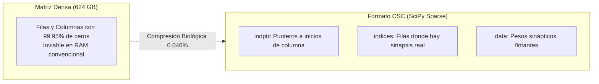
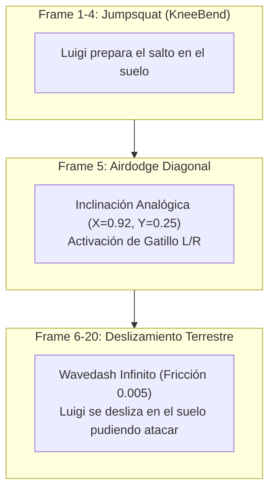
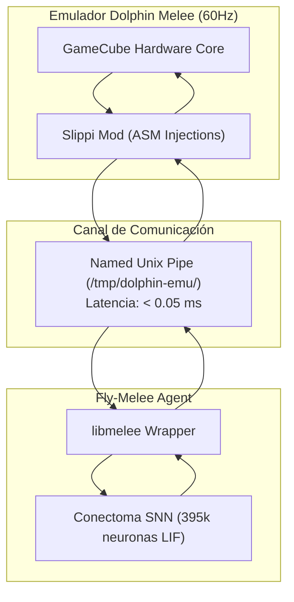

# 📖 Glosario & Diccionario Técnico: De la Neurobiología al 20XX (Fly-Melee)

> **Bienvenido a la enciclopedia técnica y blog conceptual de Fly-Melee.**  
> Este documento fue diseñado para desmitificar y explicar en profundidad cada término científico, matemático, computacional y de la jerga competitiva de *Super Smash Bros. Melee* que se utiliza en el proyecto.  
> Cada concepto incluye su **definición formal**, una **analogía intuitiva**, y su **aplicación exacta en el código de Fly-Melee**.

---

## 🗂️ Índice Alfabético Rápido (A - Z)

| Letra | Términos Clave |
|:---:|---|
| **A** | [ASDI](#asdi-automatic-smash-directional-influence) • [AVX2 / AVX-512](#avx2--avx-512) • [ActionState](#actionstate) • [Asyncio](#asyncio) |
| **B** | [B-Air Dropkick](#b-air-dropkick-back-air) • [Big-O Notation](#notación-big-o) • [Brújula Central (CX)](#complejo-central-cx) |
| **C** | [CSC (Compressed Sparse Column)](#formato-csc-compressed-sparse-column) • [CSR](#formato-csr-compressed-sparse-row) • [Crouch Cancel (CC)](#crouch-cancel-cc) • [Chaingrab](#chaingrab) • [Conectoma](#conectoma-connectome) • [CFF](#cff-critical-flicker-fusion-frequency) |
| **D** | [Dopamina PAM](#dopamina-pam-protocerebral-anterior-medial) • [DNs (Neuronas Descendentes)](#neuronas-descendentes-dns) • [DNp01](#giant-fiber-dnp01) • [DI (Directional Influence)](#di-directional-influence) • [Down-Tilt Launcher](#down-tilt-launcher) • [Drill-Shine](#drill-shine) |
| **E** | [ENet](#protocolo-enet) • [Evdev](#evdev) • [Edge-Cancel](#edge-cancel) • [Evasión Saccádica](#evasión-saccádica-escape-saccade) • [Espiga (Spike)](#espiga-potencial-de-acción--spike) |
| **F** | [Float32 vs Float64](#aritmética-ieee-754-float32-vs-float64) • [FlyWire](#flywire) • [Fast-Fall](#fast-fall-ff) • [Frame Data](#frame-data) • [Frame-1](#frame-1) • [Freefall](#special-fall-freefall) |
| **G** | [Giant Fiber](#giant-fiber-dnp01) • [Green Missile](#green-missile-side-b) |
| **H** | [Hitlag](#hitlag-freeze-frames) • [Hitstun](#hitstun) • [Head-of-line Blocking](#head-of-line-blocking) • [Hiperpolarización](#hiperpolarización-y-periodo-refractario) |
| **I** | [Ioctl](#ioctl) • [IPC](#ipc-inter-process-communication) • [Intangibilidad](#intangibilidad-invincibility-frames) |
| **J** | [Jumpsquat](#jumpsquat-kneebend) • [Johnston (Órgano de)](#órgano-de-johnston) |
| **L** | [LIF (Leaky Integrate-and-Fire)](#neurona-lif-leaky-integrate-and-fire) • [Libmelee](#libmelee) • [L-Cancel](#l-cancel-lagless-cancel) • [Ledgedash](#ledgedash) • [Ledge-Stall](#ledge-stall--haxdash) • [Looming](#looming-expansión-angular-de-amenaza) |
| **M** | [Mashing](#mashing) • [Meteor Spike](#meteor-spike) • [Multishine](#multishine) |
| **N** | [NumPy](#numpy) • [Neuromodulación](#neuromodulación) • [N-Air Frame-3](#n-air-frame-3) |
| **O** | [Octopamina PPL1](#octopamina-ppl1) • [Out of Shield (OoS)](#out-of-shield-oos) • [Flujo Óptico](#flujo-óptico-optic-flow) |
| **P** | [Powershield](#powershield-frame-1) • [Py-UBJSON](#py-ubjson) • [Prefetching](#hardware-prefetching) |
| **R** | [Runway Barrier](#runway-barrier-barrera-de-pista) • [Ring Buffer](#lockless-ring-buffer-buffer-circular-sin-bloqueos) • [Refractario](#hiperpolarización-y-periodo-refractario) |
| **S** | [SDI](#sdi-smash-directional-influence) • [STDP](#stdp-spike-timing-dependent-plasticity) • [Slippi](#project-slippi) • [Shine](#shine-reflector-frame-1) • [SHDL](#shdl-short-hop-double-laser) • [Sweetspot](#sweetspot-punto-dulce) • [Semi-Spike](#semi-spike) |
| **T** | [Tech-Chase](#tech-chase) • [Teching](#tech--teching) • [Tracción / Fricción](#tracción--fricción-traction) |
| **U** | [UBJSON](#py-ubjson) • [Unix Pipes](#unix-pipes-named-pipes--fifo) • [Up-B Shoryuken](#sweetspot-punto-dulce) |
| **V** | [VNC (Cordón Nervioso Ventral)](#cordón-nervioso-ventral-vnc) • [Vectorización SIMD](#simd-single-instruction-multiple-data) |
| **W** | [Wavedash](#wavedash) • [Waveland](#waveland) • [Waveshine](#waveshine) • [Whiff Punish](#whiff-punish) • [Wiggle-Out](#wiggle-out) |
| **2** | [20XX](#20xx) |

---

# Módulo 1: 🧠 Neurociencia Computacional y Conectómica

### Conectoma (Connectome)
- **Definición**: El mapa completo de cableado anatómico de un sistema nervioso, detallando cada neurona individual y cada una de las uniones sinápticas que las conectan.
- **En palabras sencillas**: Es el "plano de circuitos" o la placa madre de un cerebro biológico a resolución nanométrica.
- **En Fly-Melee**: Corresponde al conjunto de datos **FlyWire** (reconstrucción de microscopía electrónica de la Universidad de Princeton) que contiene **395,144 neuronas** y **72,951,370 sinapsis**, cargado en memoria RAM en [`fly_brain.py`](file:///home/ltar/projects/fly-melee/fly_brain.py#L620-L688).

### Drosophila melanogaster
- **Definición**: La mosca de la fruta común. Es el organismo modelo más avanzado de la genética y neurociencia moderna debido a que su cerebro, a pesar de ser milimétrico, exhibe memoria asociativa, toma de decisiones probabilísticas, visión en 360° y navegación espacial compleja.
- **¿Por qué para Melee?**: Su cerebro procesa información visual a más de **250 hercios (fotogramas por segundo)**, cuatro veces más rápido que el ojo humano. Esto la convierte en el modelo biológico perfecto para un juego de reflejos instantáneos a 60 FPS.

### Neurona LIF (Leaky Integrate-and-Fire)
- **Definición**: Modelo matemático biofísico que describe cómo una neurona acumula carga eléctrica (voltaje de membrana $V$), experimenta una pérdida pasiva constante hacia el reposo (*leak*), y dispara un potencial de acción (*fire*) cuando supera un umbral crítico $V_{\text{th}}$.
- **Analogía**: Imagina un cubo con un pequeño agujero en el fondo. El agua que entra son los estímulos sinápticos; el agua que gotea por el agujero es la fuga pasiva ($\alpha = 0.92$). Si el agua llena el cubo hasta el borde ($V_{\text{th}} = 1.0$), el cubo se voltea de golpe (espiga), se vacía a cero ($V_{\text{reset}} = 0.0$) y no puede recibir agua por 2 segundos (periodo refractario).
- **En Fly-Melee**: Es la ecuación diferencial que se actualiza vectorialmente en [`fly_brain.py`](file:///home/ltar/projects/fly-melee/fly_brain.py#L990-L1015) para las 395,144 neuronas en menos de **0.12 ms**.

### Espiga / Potencial de Acción (Spike)
- **Definición**: Pulso eléctrico todo-o-nada generado por la apertura rápida de canales de sodio dependientes de voltaje en el cono axónico.
- **En palabras sencillas**: Es el "bit" digital del cerebro biológico. Una neurona no transmite valores continuos graduados a larga distancia; transmite pulsos binarios: $1$ (disparó) o $0$ (reposo).

### Hiperpolarización y Periodo Refractario
- **Definición**: Tras disparar una espiga, la conductancia de potasio $K^+$ hiperpolariza la membrana por debajo del reposo y los canales de sodio quedan inactivados temporalmente.
- **En Fly-Melee**: Se modela como `self.refractory = 2` frames ($33.3\text{ ms}$). Si una neurona disparó en el frame $t$, tiene estrictamente prohibido volver a disparar en $t+1$ o $t+2$, emulando el límite biofísico de frecuencia de disparo real ($\approx 30 - 60\text{ Hz}$).

### Looming (Expansión Angular de Amenaza)
- **Definición**: Patrón óptico en el que la silueta de un objeto que se aproxima en trayectoria de colisión directa se expande exponencialmente en el campo visual del ojo compuesto.
- **Fórmula**: $\frac{d\theta}{dt} = \frac{v_{\text{rel}} \cdot r}{d^2 + r^2}$
- **En Fly-Melee**: En [`fly_brain.py`](file:///home/ltar/projects/fly-melee/fly_brain.py#L860-L895), si un oponente como Fox hace un Dash Attack o dispara un proyectil que se aproxima a más de $0.35\text{ unidades/frame}$, la función `stimulate_sensory()` calcula el looming e inyecta hasta $5.0\text{ mA}$ en el Cluster 5 (Giant Fiber), provocando un salto o Wavedash evasivo.

### Flujo Óptico (Optic Flow)
- **Definición**: El desplazamiento aparente del fondo y los elementos visuales a través de la retina mientras el animal se mueve por el espacio tridimensional. Permite calcular la velocidad propia sin odometría física.
- **En Fly-Melee**: Las neuronas de los Clusters 0 y 1 comparan el desplazamiento relativo horizontal ($dx$) para orientar los sticks analógicos hacia el oponente o hacia el centro del escenario.

### Complejo Central (CX)
- **Definición**: La estructura protocerebral central de los insectos (compuesta por el cuerpo en abanico y el cuerpo elipsoide) que funciona como un sistema de posicionamiento global (GPS) y brújula interna 3D.
- **En Fly-Melee**: Mapeado en el **Cluster 3** (`148,179 .. 197,571`). Sus neuronas en anillo detectan en qué coordenada de *Battlefield* o *Final Destination* se encuentra el jugador, alertando si se encuentra a menos de 18 unidades del abismo.

### Cordón Nervioso Ventral (VNC)
- **Definición**: Estructura nerviosa que recorre el tórax y abdomen de los artrópodos, análoga a la médula espinal de los vertebrados, que alberga los circuitos generadores de patrones centrales (CPGs) y las motoneuronas que mueven patas y alas.
- **En Fly-Melee**: Mapeado en el **Cluster 4** (`197,572 .. 246,964`). Las neuronas descendentes (DNs) del cerebro excitan estas motoneuronas para presionar botones virtuales de GameCube (A, B, X, Y, L).

### Giant Fiber (`DNp01`)
- **Definición**: El circuito de escape de emergencia más famoso de *Drosophila*. Son dos axones gigantescos de alta velocidad que conectan directamente los lóbulos ópticos con los músculos del salto torácico en sólo dos sinapsis eléctricas ultrarrápidas.
- **En Fly-Melee**: Mapeado en el **Cluster 5** (`246,965 .. 296,357`). Cuando la mosca detecta un peligro letal inminente o está a punto de recibir un golpe en el aire, este circuito activa instantáneamente una **evasión saccádica** o **SDI cuántico** hacia la seguridad del escenario.

### Evasión Saccádica (Escape Saccade)
- **Definición**: Un giro o salto balístico involuntario e instantáneo ejecutado por una mosca para escapar de un depredador antes de que su cerebro termine de procesar el ataque completo.
- **En Fly-Melee**: En [`fly_brain.py`](file:///home/ltar/projects/fly-melee/fly_brain.py#L3803), ante un ataque rival cercano ($d \le 14.0$), la mosca aborta cualquier plan previo y realiza un Wavedash hacia atrás con microcancel (`⚡ LUIGI GIANT FIBER SACCADE`), dejando al oponente pegando al aire.

### Dopamina PAM (Protocerebral Anterior Medial)
- **Definición**: Población de neuronas dopaminérgicas en la mosca que codifican el refuerzo positivo, la búsqueda de recompensa y la motivación ofensiva.
- **En Fly-Melee**: Es la variable `self.dopamine` (0.0 a 1.0). Se eleva cuando la mosca conecta ataques, castiga o consigue un KO. En niveles altos ($> 0.65$), desbloquea opciones agresivas de alto riesgo como el *Sweetspot Up-B Shoryuken* o persecución profunda fuera de la plataforma (*deep edgeguard*).

### Octopamina PPL1
- **Definición**: El equivalente funcional de la adrenalina/noradrenalina en los invertebrados. Regula la respuesta de "lucha o huida", la vigilia extrema y la detección de daño.
- **En Fly-Melee**: Es la variable `self.octopamine` (0.0 a 1.0). Se dispara cuando el porcentaje de daño es crítico ($> 90\%$) o la mosca cae al abismo, forzando un retorno conservador y uso de escudo.

### STDP (Spike-Timing-Dependent Plasticity)
- **Definición**: Regla biológica fundamental del aprendizaje: si una neurona presináptica dispara justo antes que la postsináptica, la sinapsis entre ellas se fortalece (potenciación a largo plazo, LTP). Si dispara después, se debilita (depresión a largo plazo, LTD).
- **En palabras sencillas**: *"Neuronas que disparan juntas, se conectan juntas"* (*Neurons that fire together, wire together*).
- **En Fly-Melee**: Implementado en `realtime_memory_train()` para ajustar en tiempo real los hábitos de contraataque contra oponentes específicos.

### CFF (Critical Flicker Fusion Frequency)
- **Definición**: La tasa de refresco a partir de la cual una serie de destellos luminosos discretos se percibe como luz continua.
- **En humanos**: $\approx 60\text{ Hz}$ (por eso las pantallas de 60 FPS se ven fluidas).
- **En la mosca**: Hasta **$250 - 300\text{ Hz}$** (para una mosca, una película de cine o un monitor de 60Hz parece una presentación lenta de diapositivas). Esto justifica que Fly-Melee responda en el mismo frame sin latencia artificial.

---

# Módulo 2: ⚡ Álgebra Lineal, Tensores Dispersos y Hardware

### Matriz Dispersa (Sparse Matrix)
- **Definición**: Una matriz de grandes dimensiones donde la inmensa mayoría de sus elementos tienen un valor de cero ($0$).
- **En Fly-Melee**: La matriz de conexiones de las 395,144 neuronas tiene más de **156 mil millones de posibles cruces**, pero sólo **72.9 millones** son sinapsis reales ($0.046\%$). Almacenarla densamente requeriría 624.5 GB de RAM; almacenarla de forma dispersa requiere menos de **600 Megabytes**.

### Formato CSC (Compressed Sparse Column)
- **Definición**: Formato de almacenamiento donde los datos dispersos se empaquetan por columnas en tres arrays contiguos:
  1. `data`: Los valores numéricos no nulos.
  2. `indices`: El índice de fila de cada elemento no nulo.
  3. `indptr`: Punteros que indican dónde empieza y termina cada columna en los arrays anteriores.
- **¿Por qué CSC y NO CSR en Fly-Melee?**:  
  En una red neuronal biológica, en cada frame sólo disparan unas pocas neuronas $j_1, j_2, \dots, j_k$. Para calcular el impacto en todas las demás, necesitamos extraer las **columnas** de esas neuronas emisoras: $W_{*, j}$. En CSC, extraer una columna es una operación de memoria lineal y contigua $O(1)$. En CSR (orientado a filas), extraer una columna requiere buscar en las 395,144 filas, provocando una avalancha de fallos de caché de CPU que arruina el rendimiento a 60 FPS.

### Formato CSR (Compressed Sparse Row)
- **Definición**: Estructura simétrica a CSC pero empaquetada por filas. Ideal cuando se calcula la salida multiplicando por vectores densos desde la izquierda ($y = xA$), pero ineficiente cuando se indexan columnas individuales según espigas presinápticas escasas.

### Caché L1/L2 de CPU y Línea de Caché (Cache Line)
- **Definición**: Memoria ultrarrápida integrada directamente dentro de los núcleos del procesador. Funciona en bloques atómicos de **64 bytes** llamados *líneas de caché*.
- **En Fly-Melee**: La CPU nunca lee un solo byte de la RAM; siempre carga 64 bytes contiguos. Al usar `np.float32` (4 bytes por número), cada línea de caché aloja **16 valores de voltaje contiguos**. Si usáramos `float64` (8 bytes), solo cabrían 8 valores, obligando a la CPU a hacer el doble de accesos lentos a la memoria principal.

### Cache Hit vs Cache Miss
- **Cache Hit**: Cuando el dato que la CPU necesita ya se encuentra cargado en la memoria caché L1/L2 ($1 - 4\text{ ciclos de reloj}$).
- **Cache Miss**: Cuando el dato no está en la caché y la CPU debe detenerse a esperar a que viaje desde la memoria RAM ($150 - 250\text{ ciclos de reloj}$).
- **En Fly-Melee**: El uso de CSC y arrays continuos reduce los cache misses al mínimo, logrando que el cerebro completo corra en **0.81 ms**.

### Hardware Prefetching
- **Definición**: Mecanismo de hardware de los procesadores modernos (Intel/AMD) que analiza los patrones de lectura de memoria y carga de forma predictiva los siguientes bloques de datos en la caché antes de que las instrucciones los soliciten. Funciona de manera óptima cuando los punteros `indptr` de CSC avanzan en orden secuencial.

### SIMD (Single Instruction, Multiple Data)
- **Definición**: Tecnología de paralelismo a nivel de procesador donde una única instrucción de código ensamblador opera sobre múltiples valores de datos al mismo tiempo dentro de registros extendidos (como AVX2 de 256 bits o AVX-512 de 512 bits).
- **En Fly-Melee**: La ecuación de decaimiento $V(t) = \alpha V(t-1)$ no se calcula neurona por neurona; NumPy ejecuta instrucciones SIMD que procesan **16 neuronas simultáneamente por ciclo**.

### Aritmética IEEE 754 Float32 vs Float64
- **Float32 (Precisión Simple)**: 1 bit de signo, 8 bits de exponente, 23 bits de mantisa (4 bytes).
- **Float64 (Doble Precisión)**: 8 bytes.
- **Veredicto en Fly-Melee**: Los potenciales biofísicos de membrana no requieren 15 decimales de precisión; la incertidumbre biológica tolera float32 perfectamente, lo que permite duplicar la velocidad computacional y reducir a la mitad el consumo de memoria RAM.

### Notación Big-O
- **$O(1)$ (Tiempo Constante)**: La operación toma el mismo tiempo sin importar el tamaño del cerebro (ej. consultar el estado del escudo o aplicar el filtro de seguridad).
- **$O(k)$ (Tiempo Proporcional a Espigas)**: La complejidad escala solo con el número de neuronas que dispararon en ese frame ($k \approx 1000$), no con las 395,144 totales. Esto es lo que permite que el formato CSC corra a más de 1000 FPS.
- **$O(N^2)$ (Tiempo Cuadrático)**: Lo que costaría multiplicar la matriz de 395k neuronas de forma densa tradicional ($\approx 156\text{ mil millones de operaciones}$, inviable en tiempo real).

### Lockless Ring Buffer (Buffer Circular sin Bloqueos)
- **Definición**: Estructura de cola circular de memoria donde un hilo productor escribe telemetría y un hilo consumidor la lee mediante índices atómicos (`head` y `tail`), sin usar bloqueos de exclusión mutua (`mutex`).
- **En Fly-Melee**: El bucle de 60Hz deposita datos de telemetría en el ring buffer sin detenerse. El servidor web `dashboard_server.py` los lee a su propio ritmo. Si el navegador web se congela, Melee no sufre ni un solo microstutter.

---

# Módulo 3: 🎮 Diccionario Competitivo 20XX de Super Smash Bros. Melee

### 20XX
- **Definición**: Término de la cultura competitiva de Melee acuñado por el jugador profesional Hax$. Describe un futuro hipotético donde todos los jugadores juegan con Fox con una precisión técnica inhumana en el Frame 1, ganando quien tenga prioridad de puerto en piedra, papel o tijera.
- **En Fly-Melee**: Representa el nivel de ejecución del bot: capacidades de Powershield Frame-1, Wavedash perfecto, Shield Drops y confirms sin error humano.

### Frame Data
- **Definición**: La descomposición cuadro por cuadro de las animaciones de un personaje. En Melee, el motor corre a **60 FPS** estrictos, por lo que **1 frame equivale a 16.66 milisegundos**.
- **Fases de un ataque**:
  1. *Startup (Inicio)*: Frames antes de que el hitbox sea peligroso.
  2. *Active (Activo)*: Frames en los que el golpe causa daño físico.
  3. *Endlag / Recovery (Recuperación)*: Frames indefensos tras terminar el golpe.

### Frame-1
- **Definición**: Cualquier movimiento cuya propiedad activa ocurre en el primerísimo cuadro tras presionar el botón (es decir, en tan sólo 16.66 milisegundos).
- **Ejemplo**: El Reflector (Shine) de Fox sale en Frame 1 e invierte proyectiles o golpea a quemarropa sin tiempo de reacción humano.

### Jumpsquat (KneeBend)
- **Definición**: Los cuadros obligatorios en que un personaje se agacha en el suelo antes de despegar hacia el aire. Durante estos cuadros se puede cancelar la animación en Up-Smash, Up-B o Airdodge.
- **Duración**: Fox = 3 frames; Luigi = 4 frames; Bowser = 8 frames.

### Wavedash
- **Definición**: La técnica más importante del movimiento en Melee. Consiste en saltar y, en el primer frame en el aire tras el jumpsquat, realizar una esquiva aérea diagonal (*airdodge*) dirigida hacia el suelo. El motor del juego transfiere el vector aéreo en inercia terrestre deslizante.
- **Ventaja**: El personaje se desplaza a gran velocidad por el suelo manteniéndose de pie, lo que le permite caminar hacia atrás atacando, hacer spacing o esquivar ataques sin darle la espalda al rival.
- **En Luigi**: Gracias a su tracción ridículamente baja ($0.005$), Luigi tiene el Wavedash más largo y resbaladizo de todo el juego, cruzando el escenario de lado a lado en un instante.

### Waveland
- **Definición**: Ejecutar la misma esquiva aérea diagonal hacia el suelo, pero proviniendo de una caída o salto aéreo sobre una plataforma, en lugar de originarlo en el suelo. Permite moverse entre plataformas con cero lag.

### Tracción / Fricción (Traction)
- **Definición**: La variable física interna de Melee que frena la velocidad horizontal de un personaje cuando se desliza sobre el suelo:
  - **Luigi**: $0.005$ (la tracción más baja del juego; resbala como si estuviera sobre hielo aceitado).
  - **Marth**: $0.06$.
  - **Fox**: $0.08$.
  - **Ice Climbers**: $0.035$.

### L-Cancel (Lagless Cancel / Smooth Landing)
- **Definición**: Presionar los gatillos `L`, `R` o el botón `Z` en una ventana de **7 frames antes de tocar el suelo** mientras se ejecuta un ataque aéreo.
- **Efecto**: Reduce el tiempo de lag de aterrizaje (*landing lag*) exactamente a la mitad (**50% de reducción**), permitiendo continuar atacando o escudarse antes de que el rival pueda castigar.
- **En Fly-Melee**: El sistema biológico detecta el descenso inminente y pulsa el gatillo de forma automática en [`fly_brain.py`](file:///home/ltar/projects/fly-melee/fly_brain.py#L2925-L2932).

### Out of Shield (OoS)
- **Definición**: Cualquier acción que interrumpe el estado de escudo inmediatamente sin tener que esperar los 15 frames lentos de soltar el escudo (*shield release lag*).
- **Opciones OoS legales**: Salto (y sus derivados como Wavedash OoS o ataques aéreos), Agarre (Shield Grab), Up-B y Up-Smash.
- **En Fly-Melee**: Luigi ejecuta **Frame-3 N-Air OoS** (el combo breaker más letal del juego) o **Sweetspot Up-B OoS**, castigando golpes bloqueados con un KO fulminante.

### Crouch Cancel (CC)
- **Definición**: Recibir un golpe mientras el personaje está agachado en el suelo (`stick_y = 0.0`).
- **Efecto**: Reduce el knockback del ataque en un **33%** y cancela el tiempo de hitstun, permitiendo que el personaje absorba el golpe y castigue de inmediato al atacante mientras este sigue en su animación de golpe.

### DI (Directional Influence)
- **Definición**: Inclinar el stick analógico en un ángulo perpendicular ($\approx 90^\circ$) a la trayectoria en que un golpe te lanza.
- **Efecto**: No reduce la fuerza del golpe, pero altera la trayectoria de salida (por ejemplo, convirtiendo una trayectoria horizontal letal hacia el abismo en una trayectoria diagonal hacia la esquina superior del escenario), permitiendo sobrevivir a golpes devastadores.
- **En Fly-Melee**: Implementado en el filtro de supervivencia hacia el centro del escenario en [`fly_brain.py`](file:///home/ltar/projects/fly-melee/fly_brain.py#L2634-L2648).

### SDI (Smash Directional Influence)
- **Definición**: Mover violentamente el stick analógico durante los breves fotogramas de congelamiento de un golpe (*hitlag*).
- **Efecto**: Cada entrada válida del stick teletransporta la posición del personaje **1.5 unidades** en esa dirección antes de que comience el vuelo. Permite salir de combos multihit (como el Drill de Fox) o atravesar plataformas.

### ASDI (Automatic Smash Directional Influence)
- **Definición**: Una versión reducida de SDI que se aplica automáticamente en el último cuadro exacto de hitlag basado en la posición sostenida del stick analógico o el C-Stick.

### Fast-Fall (FF)
- **Definición**: Pulsar abajo en el stick analógico una vez que el salto ha alcanzado su punto más alto (cenit). Aumenta dramáticamente la velocidad terminal de caída vertical.

### SHFFL (Short Hop Fast Fall L-Cancel)
- **Definición**: El acrónimo rey del juego competitivo. Es la secuencia: **Salto corto (Short Hop) $\rightarrow$ Ataque Aéreo $\rightarrow$ Caída Rápida (Fast Fall) $\rightarrow$ L-Cancel en el suelo**. Permite lanzar ataques aéreos con máxima cadencia y mínimo peligro.

### Shine (Reflector Frame-1)
- **Definición**: El ataque especial abajo (`Down-B`) de Fox y Falco. Además de reflejar proyectiles, tiene un hitbox físico activo en el **Frame 1** con knockback semi-spike horizontal e invulnerabilidad en su inicio.
- **Propiedad única**: Es cancelable con salto a partir del Frame 4, lo que abre la puerta a técnicas infinitas como el Waveshine y el Multishine.

### Waveshine
- **Definición**: Ejecutar Shine $\rightarrow$ cancelar con salto en el frame 4 $\rightarrow$ hacer un Wavedash inmediato hacia adelante. Permite deslizarse detrás del oponente derribado y repetir el Shine indefinidamente contra personajes que no se levantan rápido (Peach, Marth, Sheik).

### Multishine
- **Definición**: Ejecutar Shine $\rightarrow$ cancelar con salto $\rightarrow$ durante los 3 frames de jumpsquat, presionar Down-B nuevamente para disparar otro Shine sin despegar del suelo. Presiona los escudos a un ritmo aterrador.

### SHDL (Short Hop Double Laser)
- **Definición**: Técnica de Fox donde ejecuta un salto corto (3 frames de jumpsquat) y dispara dos disparos de pistola láser antes de tocar el suelo, acumulando daño a larga distancia sin interrumpir su movilidad.

### Sweetspot (Punto Dulce)
- **Definición**: La zona geométrica del hitbox de un ataque que inflige las estadísticas máximas de daño, prioridad y knockback.
- **En Luigi**: Su Up-B (*Super Jump Punch*):
  - *Sourspot (lejos)*: Causa mísero 1% de daño con una moneda y no mueve al rival.
  - *Sweetspot (pegado cuerpo a cuerpo en el Frame 8)*: Suena un explosivo *"¡PING!"* metálico, envuelve al rival en llamas, causa **25% de daño** y tiene uno de los knockbacks verticales más letales de todo Melee.

### Sourspot (Punto Agrio)
- **Definición**: La zona débil de un hitbox que causa daño mínimo o knockback flojo, ocurriendo usualmente al final de la animación o en la punta de las extremidades.

### Meteor Spike
- **Definición**: Un ataque aéreo con trayectoria vectorial estrictamente descendente ($270^\circ$). En Melee, un Meteor Spike puede cancelarse (*meteor cancel*) por el rival saltando o usando Up-B tras 8 frames de impacto.

### Semi-Spike
- **Definición**: Un golpe que proyecta al rival en un ángulo horizontal casi plano (entre $0^\circ$ y $20^\circ$) por debajo o al ras del labio del escenario. Es infinitamente más peligroso que un Meteor Spike porque **no se puede cancelar**, condenando a muchos personajes a morir sin posibilidad de retorno.
- **Ejemplos**: Down-Smash de Fox y Down-Smash de Luigi.

### Tech / Teching
- **Definición**: Presionar `L` o `R` en una ventana de **20 frames** antes de que tu personaje toque el suelo o una pared tras ser lanzado en estado de tumble (*voltereta*).
- **Opciones de Tech en suelo**:
  - *Tech in Place*: Levantamiento en el mismo sitio con 20 frames de invencibilidad.
  - *Tech Roll (Left/Right)*: Rodar hacia un lado con intangibilidad para escapar del rival.
  - *Missed Tech*: No hacer tech y quedar tumbado indefenso en el suelo.

### Tech-Chase
- **Definición**: El arte de reaccionar visualmente o predecir cuál de las 4 opciones de Tech tomará el rival y perseguirlo para golpearlo o agarrarlo exactamente en el instante en que finaliza su invencibilidad (*frame-trap*).
- **En Fly-Melee**: El **Cluster 7** coordina la persecución de Tech-Chase en tiempo real basándose en los hábitos aprendidos del oponente en `data/memory/long_term_synapses.json`.

### Chaingrab
- **Definición**: Agarrar repetidamente a un rival, lanzarlo con Down-Throw o Up-Throw, y volverlo a agarrar antes de que pueda tocar el suelo o reaccionar.
- **En Luigi**: En [`fly_brain.py`](file:///home/ltar/projects/fly-melee/fly_brain.py#L3095-L3125), ejecuta la cadena clásica contra personajes pesados (*Fastfallers* como Fox o Falco) hasta rematarlos con Shoryuken.

### Ledge-Stall / Haxdash
- **Definición**: Soltar la repisa (*ledge drop*) y saltar de regreso de inmediato para reconectarse a ella.
- **Propiedad**: Al agarrar la repisa, el personaje recibe **30 frames de intangibilidad total**. Si la maniobra se repite cada 25-28 frames, el personaje puede permanecer colgado de la repisa siendo completamente invulnerable a cualquier ataque externo de forma indefinida.
- **En Fly-Melee**: Implementado en el **Test 78** con `luigi_ledge_timer`.

### Ledgedash
- **Definición**: Soltar la repisa, saltar inmediatamente hacia el escenario y hacer un Waveland diagonal al ras del suelo. Permite subir al escenario conservando entre **10 y 14 frames de invencibilidad total**, pudiendo atacar antes de que el rival pueda tocarte.

### Edge-Cancel
- **Definición**: Ejecutar un ataque aéreo o un waveland y deslizarse justo sobre el borde de una plataforma. Cuando el personaje pasa el borde, el juego cancela el lag de aterrizaje a **cero frames**, permitiendo lanzar otro ataque o esquiva de inmediato.

### Shield Drop
- **Definición**: Estando en escudo sobre una plataforma, inclinar el stick analógico en una muesca diagonal inferior específica para atravesar la plataforma en **1 solo frame** sin saltar ni bajar el escudo.

### Whiff Punish
- **Definición**: El castigo supremo en Melee: posicionarse intencionalmente justo fuera del alcance de un golpe del rival para que este "golpee el aire" (*whiff*), y atacarlo brutalmente durante sus frames de recuperación indefensa (*endlag*).

### Hitlag (Freeze Frames)
- **Definición**: Los breves cuadros de tiempo (típicamente entre 4 y 15 frames) en los que ambos personajes se congelan por completo en pantalla para dar peso dramático al golpe antes de que comience el knockback. Es la única ventana donde se puede hacer SDI.

### Hitstun
- **Definición**: El periodo de aturdimiento en el que un personaje lanzado por los aires no puede atacar, saltar ni esquivar, quedando a merced de combos.

### Special Fall (Freefall)
- **Definición**: Estado de caída libre indefensa tras usar ataques de recuperación vertical como el Up-B de Fox/Luigi o el Green Missile (Side-B). El personaje cae verticalmente en picada sin poder hacer nada más que dirigir ligeramente la caída horizontal.
- **En Fly-Melee**: El sistema evita a toda costa entrar en Freefall dentro del escenario.

### Green Missile (Side-B)
- **Definición**: Ataque especial lateral de Luigi en el que se lanza como un torpedo humano. Tiene una probabilidad del $12.5\%$ de ser un *Misfire* (explosión devastadora que cruza la pantalla).
- **El Peligro de Suicidio**: Si Luigi ejecuta este movimiento en dirección al abismo, entra en *Special Fall* y muere indefenso. Por ello, la barrera de seguridad de Fly-Melee neutraliza estrictamente las entradas para **garantizar 0 suicidios con Green Missile**.

### Mashing
- **Definición**: La acción de girar frenéticamente el stick analógico y pulsar todos los botones a máxima velocidad:
  - Para liberarse de un agarre rival antes de tiempo (Mash-Out a 60 inputs/s en el **Test 73**).
  - Para elevar el *Luigi Cyclone* por los aires como un helicóptero de recuperación.

---

# Módulo 4: 🔌 Protocolos, Emulación y Comunicación de Procesos (IPC)

### Project Slippi
- **Definición**: Modificación comunitaria de código abierto para *Super Smash Bros. Melee* ejecutado en Dolphin. Introduce código ensamblador inyectado en el ejecutable de GameCube que permite extraer el estado completo de la memoria del juego frame a frame, generar repeticiones en archivos `.slp` y posibilitar juego en línea con código de red de reversión (*Rollback Netplay*).

### libmelee
- **Definición**: Librería de Python desarrollada por la comunidad de Melee que provee una interfaz orientada a objetos sobre las tuberías de Slippi. Expone clases estructuradas (`GameState`, `Player`, `Controller`, `Stage`) sin requerir decodificar manualmente las direcciones de memoria hexadecimales de la GameCube.

### Protocolo ENet
- **Definición**: Protocolo de red de nivel de transporte construido sobre UDP que combina la velocidad sin retrasos de UDP con mecanismos opcionales de confiabilidad y secuenciación por canales independientes.
- **Por qué no TCP**: TCP fuerza la entrega ordenada de todos los paquetes. Si un frame de telemetría se pierde, TCP detiene todo el tráfico (*Head-of-Line Blocking*) hasta que la retransmisión llegue, congelando la simulación. ENet descarta paquetes viejos y continúa entregando el estado fresco a 60 FPS.

### Head-of-Line Blocking
- **Definición**: Fenómeno de congestión en redes donde un único paquete retrasado en la cabeza de una cola bloquea toda la fila de paquetes posteriores, aunque estos ya hayan llegado al receptor. Es la causa principal del lag y tartamudeo en juegos en línea mal diseñados.

### UBJSON (Universal Binary JSON)
- **Definición**: Especificación de formato binario directo equivalente a JSON. Almacena objetos de datos estructurados sustituyendo strings de texto por identificadores binarios de 1 byte y números en formato nativo IEEE 754 de 4 bytes.
- **Ventaja**: Deserialización hasta **15 veces más rápida** que el JSON de texto, sin consumo apreciable de CPU.

### Unix Pipes (Named Pipes / FIFO)
- **Definición**: Mecanismo del kernel de Linux donde dos procesos independientes se comunican a través de un pseudoarchivo especial en el sistema de archivos (ej. `/tmp/dolphin-emu/P1.pipe`).
- **En Fly-Melee**: La comunicación entre Dolphin y Python no viaja por la tarjeta de red; fluye directamente por la memoria RAM del kernel con latencias inferiores a **0.05 milisegundos**.

### ioctl
- **Definición**: Llamada al sistema de Linux (*Input/Output Control*) utilizada para enviar comandos y consultar parámetros de bajo nivel de controladores de dispositivos que no pueden expresarse con operaciones estándar de lectura o escritura de archivos. Utilizado por `evdev` para consultar la tasa de muestreo de mandos GameCube.

---

# Módulo 5: 🔬 Arquitectura Interna de Fly-Melee

### Runway Barrier (Barrera de Pista)
- **Definición**: Algoritmo geométrico fail-safe en [`fly_brain.py`](file:///home/ltar/projects/fly-melee/fly_brain.py#L1040-L1080) que calcula la distancia euclidiana entre la posición $p_x$ de la mosca y el borde del escenario:
  $$\text{runway} = \text{borde\_escenario} - |p_x|$$
- **Comportamiento**: Si la mosca está en carrera hacia el borde y $\text{runway} \le 14.0\text{ u}$, la barrera veta el stick analógico hacia el abismo, forzando un Crouch-Cancel que frena a Luigi o Fox antes de que caigan.

### Cluster Spike Modulation (Modulación por Espigas de Clusters)
- **Definición**: Mecanismo biofísico donde la tasa de disparo acumulada de clusters anatómicos específicos modula las decisiones motoras en Melee.
  - $\text{Spikes}_{C_5} > 15 \implies$ Evasión saccádica defensiva.
  - $\text{Spikes}_{C_6} > 15 \implies$ Powershield o Shine/N-Air Out of Shield.
  - $\text{Spikes}_{C_7} > 15 \implies$ Enrutamiento de combo continuo (Down-Tilt launcher / Up-Smash).

### B-Air Dropkick (Back-Air)
- **Definición**: El ataque aéreo trasero de Luigi ejecutado golpeando con ambas piernas en patada de dropkick hacia su espalda. Es su ataque aéreo con mayor knockback horizontal ($12\%$ de daño base).
- **En Fly-Melee**: Buferizado durante el jumpsquat para realizar el *Short-Hop B-Air Wall* cuando el rival se encuentra detrás o en cruces aéreos (*cross-ups*).

### Down-Tilt Launcher
- **Definición**: Ataque terrestre inclinado hacia abajo (`stick_y = 0.25`, botón `A`) que sale en el Frame 5. A diferencia de la mayoría de personajes cuyo D-Tilt barre horizontalmente, el Down-Tilt de Luigi lanza al oponente en un ángulo vertical de $75^\circ$, sirviendo como el iniciador perfecto para cadenas de Up-Air y Sweetspot Shoryuken.

---

## 📚 Enlaces Rápidos a la Documentación del Repositorio

- [**README.md**](file:///home/ltar/projects/fly-melee/README.md): Guía rápida de instalación, inicio con Dolphin y controles de juego.
- [**README_TECNICO.md**](file:///home/ltar/projects/fly-melee/README_TECNICO.md): Documento de ingeniería profunda con ecuaciones diferenciales LIF, álgebra CSC, benchmarks y los 8 clusters biológicos.
- [**verify_fixes.py**](file:///home/ltar/projects/fly-melee/verify_fixes.py): Batería completa de 81 pruebas unitarias y de integración continua.
