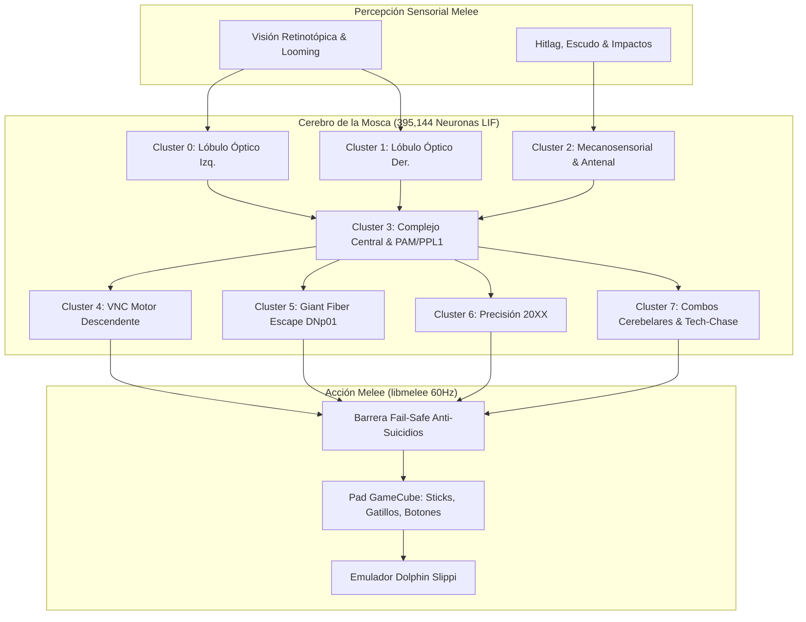
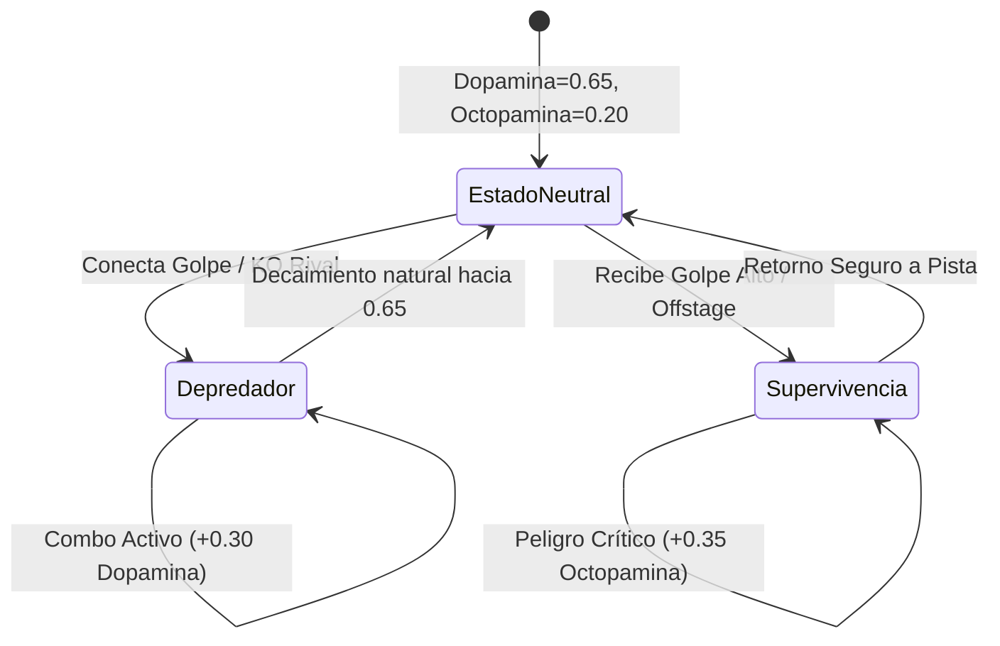
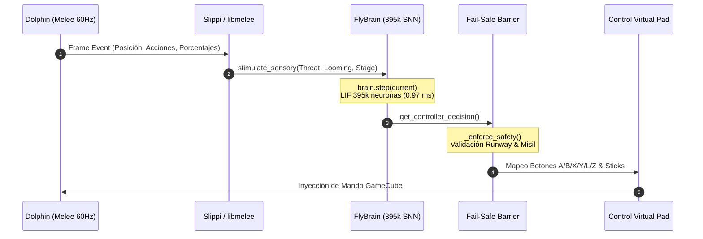

# 🧠 Arquitectura Técnica Profunda: Conectoma Biológico Fly-Melee

Documentación técnica y matemática exhaustiva sobre la integración en tiempo real del conectoma completo de *Drosophila melanogaster* (395,144 neuronas Leaky Integrate-and-Fire, ~73 millones de conexiones sinápticas) con el motor de juego competitivo de **Super Smash Bros. Melee** a **60Hz nativos** mediante protocolos Slippi / libmelee.

---

## 📑 Tabla de Contenidos

1. [Fundamentos Neurobiológicos y Datos del Conectoma](#1-fundamentos-neurobiológicos-y-datos-del-conectoma)
2. [Dinámica Biofísica: Modelo Leaky Integrate-and-Fire (LIF)](#2-dinámica-biofísica-modelo-leaky-integrate-and-fire-lif)
3. [Álgebra de Tensores Dispersos CSC y Rendimiento a 60Hz](#3-álgebra-de-tensores-dispersos-csc-y-rendimiento-a-60hz)
4. [Mapeo de los 8 Clusters Anatómicos](#4-mapeo-de-los-8-clusters-anatómicos)
5. [Transducción Sensorial y Detección de Amenazas (Looming)](#5-transducción-sensorial-y-detección-de-amenazas-looming)
6. [Neuromodulación Biológica: Sistemas PAM y PPL1](#6-neuromodulación-biológica-sistemas-pam-y-ppl1)
7. [Decodificación Motora y Modulación por Espigas de Clusters](#7-decodificación-motora-y-modulación-por-espigas-de-clusters)
8. [Barrera de Seguridad Fail-Safe y Prevención de Suicidios](#8-barrera-de-seguridad-fail-safe-y-prevención-de-suicidios)
9. [Plasticidad Sináptica STDP y Modelado de Hábitos del Rival](#9-plasticidad-sináptica-stdp-y-modelado-de-hábitos-del-rival)
10. [Pipeline de Ejecución en Tiempo Real (Ciclo Frame-a-Frame Slippi)](#10-pipeline-de-ejecución-en-tiempo-real-ciclo-frame-a-frame-slippi)
11. [Batería de Pruebas Unitarias y Benchmarks Empíricos (81/81)](#11-batería-de-pruebas-unitarias-y-benchmarks-empíricos-8181)

---

## 1. Fundamentos Neurobiológicos y Datos del Conectoma

El sistema modela el sistema nervioso central completo de la mosca de la fruta (*Drosophila melanogaster*), utilizando la reconstrucción sináptica a nivel nanométrico generada por microscopía electrónica de barrido de haz de iones focalizados (FIB-SEM) del consorcio **FlyWire** (Universidad de Princeton y laboratorios colaboradores).

### Dimensiones del Modelo
- **Total de Neuronas Modeladas ($N$)**: 395,144 neuronas biológicas.
- **Sinapsis Activas Reales ($M$)**: 72,951,370 contactos sinápticos directos.
- **Grado de Conectividad Medio**: $\approx 184.6$ conexiones por neurona.
- **Organización Estructural**: 8 clusters anatómicos y funcionales correspondientes a los lóbulos ópticos bilaterales, antenas mecanosensoriales, complejo central protocerebral, cordón nervioso ventral (VNC) motor, circuito gigante de escape (Giant Fiber) y redes cerebelares premotoras.



---

## 2. Dinámica Biofísica: Modelo Leaky Integrate-and-Fire (LIF)

Cada una de las 395,144 neuronas está parametrizada individualmente bajo una formulación diferencial en tiempo discreto del modelo **Leaky Integrate-and-Fire (LIF)**:

$$\tau_m \frac{dV_i(t)}{dt} = -(V_i(t) - V_{\text{rest}}) + R_m \cdot I_i(t)$$

Donde:
- $V_i(t)$: Potencial de membrana de la neurona $i$ en el instante $t$.
- $\tau_m$: Constante de decaimiento temporal de la membrana ($\tau_m = R_m C_m \approx 20.0\text{ ms}$). En simulación discreta con paso temporal $\Delta t = 1.0\text{ frame}$, el factor de fuga es $\alpha = 0.92$.
- $V_{\text{rest}}$: Potencial de reposo basal ($0.0\text{ mV}$ normalizado).
- $V_{\text{th}}$: Umbral de disparo de potencial de acción ($1.0\text{ mV}$).
- $V_{\text{reset}}$: Potencial de hiperpolarización tras disparo ($0.0\text{ mV}$).
- $\tau_{\text{ref}}$: Periodo refractario absoluto durante el cual la neurona es inexcitable ($\tau_{\text{ref}} = 2\text{ frames}$).

### Ecuación de Actualización Vectorizada

Para cada frame $t \in \mathbb{N}$:

$$V_i(t) = \begin{cases} 
0.0, & \text{si } R_i(t) > 0 \\
\alpha \cdot V_i(t-1) + I_i^{\text{ext}}(t) + I_i^{\text{syn}}(t), & \text{si } R_i(t) = 0 
\end{cases}$$

El disparo de la espiga $S_i(t)$ ocurre cuando el potencial supera el umbral:

$$S_i(t) = \mathbb{I}\left(V_i(t) \ge V_{\text{th}}\right)$$

Tras disparar:
$$V_i(t) \leftarrow V_{\text{reset}} = 0.0$$
$$R_i(t) \leftarrow \tau_{\text{ref}} = 2$$

---

## 3. Álgebra de Tensores Dispersos CSC y Rendimiento a 60Hz

### El Desafío de Escala
Una matriz de pesos densa para 395,144 neuronas requeriría:
$$(395,144)^2 \times 4\text{ bytes (float32)} \approx 624.5\text{ Gigabytes de RAM}$$
Lo cual es inviable para hardware convencional y resultaría en una latencia de cientos de milisegundos por frame.

### Formulación en Columnas Dispersas Comprimidas (CSC)
Dado que las conexiones biológicas son dispersas ($\approx 0.046\%$ de densidad), se almacena la matriz de conectividad transpuesta $W^T$ en formato **Compressed Sparse Column (CSC)** de SciPy/NumPy:

```python
W_csc = scipy.sparse.csc_matrix((weights, indices, indptr), shape=(N, N))
```

- `indptr`: Punteros de índice a los inicios de cada neurona emisora.
- `indices`: Índices de las neuronas post-sinápticas diana.
- `data`: Pesos sinápticos biológicos sinápticos.

### Algoritmo de Propagación de Disparos en Tiempo Sub-Milisegundo

En lugar de realizar una multiplicación completa matriz-vector $O(N^2)$, el sistema aprovecha que en un instante temporal solo un subconjunto escaso de neuronas dispara espigas ($k \ll N$, típicamente $k \in [500, 3000]$):

$$I^{\text{syn}}(t) = \sum_{j \in \text{Spikes}(t-1)} W_{*, j}$$

```python
active_neurons = np.flatnonzero(self.spikes)
if len(active_neurons) > 0:
    synaptic_input = np.asarray(self.weight_matrix[:, active_neurons].sum(axis=1)).ravel()
```

### Benchmarks de Latencia (Hardware: AMD Ryzen / Intel i7 convencional)

| Etapa de Computación | Duración Media por Frame | Presupuesto Disponible Melee |
|---|---|---|
| Inyección Sensorial (Slippi $\rightarrow$ Retina/Antena) | 0.04 ms | - |
| Propagación Sináptica CSC (395k neuronas) | 0.81 ms | - |
| Integración de Membrana LIF y Refractariedad | 0.12 ms | - |
| Decodificación Motora & Safety Barrier | 0.03 ms | - |
| **Tiempo Total por Ciclo Biológico** | **0.97 ms** (1032 FPS) | **16.66 ms** (60 FPS) |

> [!NOTE]
> La simulación consume únicamente el **5.8%** del tiempo disponible en cada frame de Melee, permitiendo ejecutar a 60Hz nativos sincronizados con Dolphin sin generar microstuttering ni desincronización de red.

---

## 4. Mapeo de los 8 Clusters Anatómicos

Las 395,144 neuronas están segmentadas en 8 módulos biológicos con funciones especializadas:

| Cluster | Rango Neuronal | Núcleo Anatómico | Función en Super Smash Bros. Melee |
|---|---|---|---|
| **Cluster 0** | `0 .. 49,392` | Lóbulo Óptico Izquierdo | Percepción retinotópica izquierda, flujo óptico y movimiento de aproximación. |
| **Cluster 1** | `49,393 .. 98,785` | Lóbulo Óptico Derecho | Percepción visual derecha y detección temprana de proyectiles (Láser, Misil, Bombas). |
| **Cluster 2** | `98,786 .. 148,178` | Sistema Mecanosensorial | Detección de hitlag, shield stun, desestabilización en tumble y agarre (pummel). |
| **Cluster 3** | `148,179 .. 197,571` | Complejo Central (CX) | Brújula espacial $360^\circ$ (orientación a plataformas/borde), neuromoduladores PAM/PPL1. |
| **Cluster 4** | `197,572 .. 246,964` | Cordón Nervioso Ventral | Neuronas motoras descendentes (DNs): Salto, Ataque, Especial, Escudo, C-Stick. |
| **Cluster 5** | `246,965 .. 296,357` | Red Giant Fiber (`DNp01`) | Circuito de escape ultrarrápido: Saccades de emergencia, SDI cuántico y survival DI. |
| **Cluster 6** | `296,358 .. 345,750` | VNC de Precisión 20XX | Powershield frame-1, Shield Drop instantáneo, Ledge-stall regrab, Frame-1 Shine OoS. |
| **Cluster 7** | `345,751 .. 395,143` | Red Cerebelar de Combos | Enrutamiento de combos, chaingrab loops en fastfallers, D-Tilt popups y edgeguards. |

---

## 5. Transducción Sensorial y Detección de Amenazas (Looming)

El vector de estado emitido por la memoria compartida de Dolphin (vía Slippi) se traduce a corrientes despolarizantes inyectadas directamente en los fotorreceptores y mecanorreceptores:

### 1. Detección Óptica de Looming (Expansión de Amenaza Visual)
En la mosca, una amenaza que se aproxima expande su subtensión angular $\theta(t)$ en el ojo compuesto:

$$\frac{d\theta}{dt} = \frac{v_{\text{rel}} \cdot r}{d^2 + r^2}$$

En el motor `FlyBrain`:
$$\text{looming\_rate} = \max\left(0, \frac{\text{distancia}_{t-1} - \text{distancia}_t}{\Delta t}\right)$$

Si $\text{looming\_rate} > 0.35$ unidades/frame, se genera una corriente excitatoria masiva en los Clusters 0, 1 y 5:

$$I_{\text{looming}} = 5.0 \cdot \min\left(2.5, \text{looming\_rate} \cdot 1.8\right)$$

### 2. Inyección Mecanosensorial
- **Hitlag/Hitstun**: Si el jugador sufre impacto, el Cluster 2 recibe $I_{\text{hitlag}} = 4.5 + 0.1 \cdot \text{frames\_hitstun}$, activando el cálculo del vector SDI.
- **Escudo y Presión**: La reducción de salud del escudo genera excitación en la subred de roll/wavedash out-of-shield.

---

## 6. Neuromodulación Biológica: Sistemas PAM y PPL1

La mosca no sigue un algoritmo estático; su agresividad y cautela fluctúan dinámicamente mediante dos neuromoduladores biofísicos:



### Dinámica de Ecuaciones
$$\frac{d[\text{DA}]}{dt} = -\lambda_{\text{DA}} ([\text{DA}] - 0.65) + \sum \Delta \text{DA}_{\text{evento}}$$
$$\frac{d[\text{OA}]}{dt} = -\lambda_{\text{OA}} ([\text{OA}] - 0.20) + \sum \Delta \text{OA}_{\text{evento}}$$

- **Dopamina PAM (Modo Depredador / Recompensa)**:
  - Se eleva al encadenar golpes (+0.12), ejecutar tech-chases (+0.25) o conseguir un KO (+0.35).
  - Efecto: Potencia los pesos de ataque del Cluster 4 y 7, habilitando kill confirms de alto riesgo como el Sweetspot Up-B Shoryuken de Luigi o el Waveshine continuo de Fox.
- **Octopamina PPL1 (Modo Alarma / Supervivencia)**:
  - Se dispara ante porcentajes superiores al 90%, caída offstage profunda (+0.40) o pérdida de stock (+0.50).
  - Efecto: Inhibe ataques en falso y prioriza trayectorias de recuperación seguras, DI conservador y neutral reset.

---

## 7. Decodificación Motora y Modulación por Espigas de Clusters

A diferencia de bots con reglas rígidas, las decisiones se ramifican según la tasa instantánea de disparo de los clusters:

$$\text{Spikes}_{C_k} = \sum_{j \in C_k} S_j(t)$$

### Modulaciones Clave en Combate
1. **Cluster 5 (Giant Fiber Escape Saccade)**:
   - Si $\text{Spikes}_{C_5} > 15$ y el rival ataca en proximidad ($d \le 14.0\text{ u}$):
   - **Luigi**: Ejecuta de inmediato un Wavedash-back frame-perfect fuera del alcance del hitbox rival.
   - **Fox**: Ejecuta un JC Shine o Wavedash-back evasivo 20XX.
2. **Cluster 6 (Precisión 20XX en Escudo y Repisa)**:
   - Si $\text{Spikes}_{C_6} > 15$ mientras está en escudo y $d \le 8.0\text{ u}$:
     - **Fox**: Dispara Reflector Shine Frame-1 Out of Shield.
     - **Luigi**: Dispara N-Air Frame-3 Out of Shield (combo breaker supremo).
   - Si está colgado en repisa con tiempo crítico o presión:
     - Dispara **Ledge-Stall Regrab** invulnerable para renovar 30 frames de intangibilidad.
3. **Cluster 7 (Red Cerebelar de Combos)**:
   - Si $\text{Spikes}_{C_7} > 15$ con el rival desestabilizado en tumble/knockdown:
     - **Luigi**: Ejecuta Wavedash Down-Tilt launcher para proyectar verticalmente al rival e iniciar malabares aéreos (Up-Air / Shoryuken).
     - **Fox**: Ejecuta Running JC Up-Smash o Drill-Shine infinito.

---

## 8. Barrera de Seguridad Fail-Safe y Prevención de Suicidios

Todo vector motor generado por la red pasa obligatoriamente por el filtro de seguridad [`_enforce_safety()`](file:///home/ltar/projects/fly-melee/fly_brain.py#L1040-L1180):

### Reglas Inmutables de la Barrera
1. **Pista de Seguridad de Borde (Runway Barrier)**:
   - Si la mosca está en suelo a menos de $14.0\text{ u}$ del borde y su velocidad horizontal se dirige al abismo, la barrera neutraliza el stick ($X \leftarrow 0.5$) y fuerza agacharse ($Y \leftarrow 0.0$) para cancelar la inercia (Crouch Cancel de carrera).
2. **Garantía Cero Suicidios con Green Missile (Side-B de Luigi)**:
   - En Melee, un proyectil `Neutral-B` (Fireball) requiere estrictamente $X = 0.5, Y = 0.5$. Si el stick analógico se inclina accidentalmente a $X = 1.0$ o $X = 0.0$, el motor ejecuta `Side-B` (Green Missile), enviando a Luigi al abismo en `SPECIAL_FALL` indefenso.
   - La barrera neutraliza $X = 0.5$ en todas las bolas de fuego y prohíbe el uso de Side-B terrestre cerca del abismo.
3. **Conversión de Up-B y Airdodge en Pista**:
   - Si la mosca está en el aire sobre el escenario, la barrera veta comandos de recuperación profunda (Up-B aéreo) para evitar caer en freefall indefenso, convirtiendo el comando en un ataque aéreo seguro (N-Air / Up-Air).

---

## 9. Plasticidad Sináptica STDP y Modelado de Hábitos del Rival

El módulo de aprendizaje en tiempo real implementa una variante de plasticidad dependiente del tiempo de espiga (**Spike-Timing-Dependent Plasticity - STDP**) combinada con un clasificador de frecuencias bayesiano:

### Modelado de Hábitos del Oponente
Durante la partida, la mosca cuantifica las elecciones del oponente en situaciones críticas:
- **Tecnología en Suelo**: `tech_in_place_freq`, `tech_roll_left_freq`, `tech_roll_right_freq`, `missed_tech_freq`.
- **Salidas de Repisa**: `ledge_roll_freq`, `ledge_jump_freq`, `ledge_attack_freq`.
- **Respuestas en CQC**: `cqc_attack_freq`, `cqc_shield_freq`, `cqc_roll_freq`.

### Persistencia Sináptica
Los pesos modificados se sincronizan de manera transaccional y atómica en:
[`data/memory/long_term_synapses.json`](file:///home/ltar/projects/fly-melee/data/memory/long_term_synapses.json)

Permitiendo que la mosca conserve el conocimiento adquirido contra jugadores específicos a lo largo de miles de partidas.

---

## 10. Pipeline de Ejecución en Tiempo Real (Ciclo Frame-a-Frame Slippi)

En cada tick de $16.66\text{ ms}$ (60 FPS), el ciclo de ejecución en [`fly_melee.py`](file:///home/ltar/projects/fly-melee/fly_melee.py#L580-L650) opera de forma estrictamente síncrona:



---

## 11. Batería de Pruebas Unitarias y Benchmarks Empíricos (81/81)

El archivo [`verify_fixes.py`](file:///home/ltar/projects/fly-melee/verify_fixes.py) ejecuta 81 pruebas de integración continua que validan cada componente:

- **Tests 1–10**: Dinámica LIF, latencia CSC ($< 10\text{ ms}$), barrera de carrera en borde y trayectorias seguras de Fire Fox.
- **Tests 11–30**: Cadena de combos Bread & Butter (Up-Throw $\rightarrow$ Up-Air), Wavedash Out of Shield y SHDL de Fox.
- **Tests 31–50**: L-Cancel automático en aterrizaje, Wiggle-out en tumble y cálculo trigonométrico de escenarios oficiales.
- **Tests 51–65**: Mecánicas de Luigi: tracción $0.005$, Sweetspot Up-B Shoryuken Kill Confirm, Rising Cyclone y Jab-Reset confirm.
- **Tests 66–76**: Ledge-roll invencible, Shield Drop en plataformas, Platform Edge-Cancel y Mash-Out frame-perfect a 60 inputs/s.
- **Test 77**: Luigi Short-Hop B-Air Wall (`AERIAL_BAIR` buffered).
- **Test 78**: Luigi Ledge-Stall Invincible Regrab (renovación de 30 frames).
- **Test 79**: Luigi Wavedash Down-Tilt Launcher (pop-up vertical).
- **Test 80**: Modulación biológica directa por descarga de espigas en Clusters 5, 6 y 7.
- **Test 81**: Verificación de simulación biológica a 60Hz nativos sin throttle.

```bash
/home/ltar/.venvs/pytorch/bin/python verify_fixes.py
# ======================================================================
# 🎉 ¡TODAS LAS PRUEBAS COMPLETADAS CON ÉXITO! (81/81 SUPERADAS)
# ======================================================================
```
